# Optimising Marketing Campaigns with Azure ML: Leveraging Machine Learning Pipelines for Enhanced Effectiveness

In this project, the objective is to identify effective strategies for improving future marketing campaigns in a financial institution. The problem is approached as a classification task, where the goal is to predict whether a client will subscribe to a term deposit (represented by the variable 'y') based on various factors. The aim is to enhance the institution's marketing efforts by increasing their effectiveness.

To achieve this, the project involved several key steps. Initially, a compute cluster was created to facilitate the execution of compute-intensive tasks. Next, an AutoML pipeline was developed, which involved training and evaluating multiple machine learning algorithms with different hyperparameter values. The purpose was to identify the model that achieved the highest accuracy for the given task. Once the best model was determined, it was saved, and a REST endpoint was established to enable the model to be accessed and executed from any platform using standard HTTP libraries.

Furthermore, to automate and streamline the process of building, deploying, and managing applications and data workflows, the pipeline for the best model was published. This allowed for the orchestration of complex workflows involving multiple tasks, dependencies, and integrations. While endpoints serve as a means to expose and access specific functionalities or services, pipelines provide a broader framework that facilitates the management of intricate workflows.

By implementing this project, the goal was to provide insights and recommendations that could enhance the financial institution's marketing campaigns. The combination of machine learning techniques, automated pipelines, and REST endpoints contributed to the optimization of the marketing efforts, increasing the likelihood of successful client subscriptions to term deposits.

## Architectural Diagram
The architectural diagram for the project implemented in Azure Machine Learning Studio is outlined below. The diagram illustrates the flow of operations, highlighting the critical stages that contribute to the overall project flow.

The architectural diagram for the project implemented in Azure Machine Learning Studio is outlined below. The diagram illustrates the flow of operations, highlighting the critical stages that contribute to the overall project flow.

**1. Compute Clusters:** The first step involves the creation of compute clusters with the necessary configurations. This ensures the availability of compute resources for executing the subsequent tasks.

**2. Data Retrieval and Exploration:** The Bank Marketing dataset, stored in Blob storage, is retrieved and transformed into a dataframe. This enables easier exploration and analysis of the data.

**3. AutoML Configuration:** The AutoML model is configured to manage the various steps involved in building a machine learning model. This includes pre-processing, feature engineering, and testing multiple ML models with distinct hyperparameters.

**4. AutoML Execution:** The configured AutoML job is executed to identify the best-performing model. The chosen model is then saved in the local project directory for further usage.

**5. Model Deployment:** The selected model is deployed as a real-time endpoint, accessible through standard HTTP libraries from any platform. Authentication mechanisms are enabled to ensure secure access, and application insights are incorporated for performance monitoring.

**6. API Testing:** The API is tested by sending POST requests with input data, model URL, and the required authentication tokens. This validates the functionality and accuracy of the deployed model.

**7. Swagger Documentation:** The API is documented using Swagger, providing a comprehensive overview of its functionalities and inputs. The Swagger documentation allows users to interact with and understand the API's capabilities.

**8. Performance Benchmarking:** Apache24 is utilized to benchmark the developed API, assessing its performance under high request loads. This ensures that the API performs optimally and meets the required performance standards.

**9. Pipeline Automation:** To automate the entire process, a pipeline is created in Azure ML Studio. This pipeline orchestrates the flow of data, integrates the AutoML steps, and facilitates the selection of the best-performing model.

By following this architectural flow, the project successfully leverages Azure ML Studio's capabilities to streamline the process of data ingestion, model building, deployment, and automation.
 

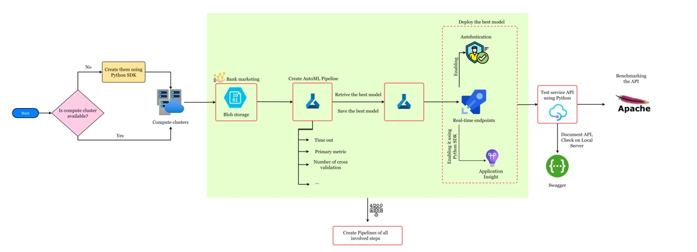

## Key Steps
*TODO*: Write a short discription of the key steps. Remeber to include all the screenshots required to demonstrate key steps. 

- Registered datasets in workspace
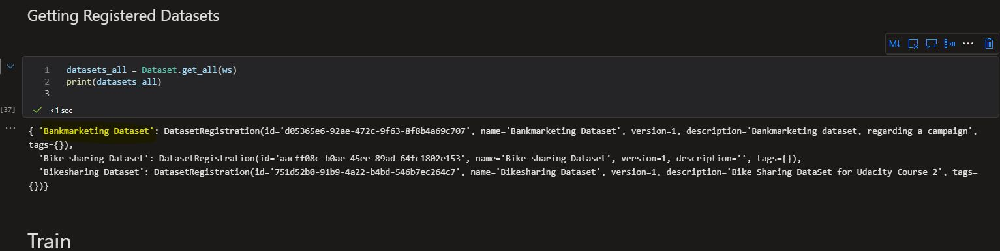

- Registered dataset of interest
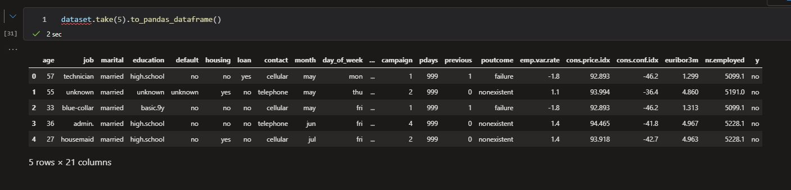

- AutoML execution, output widget
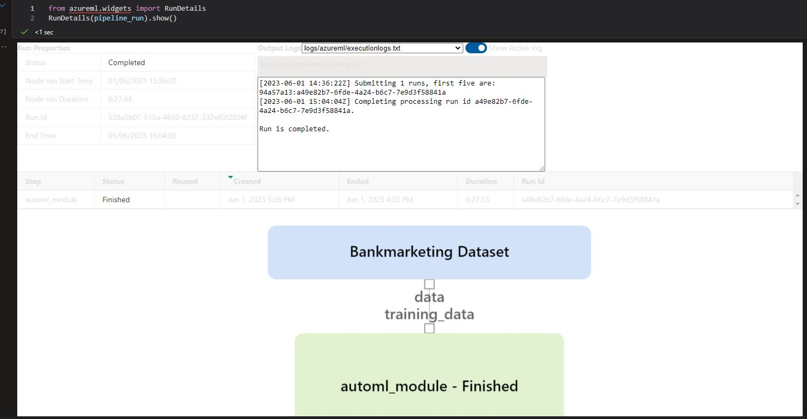

- List of deployed models, along with highlighted best model
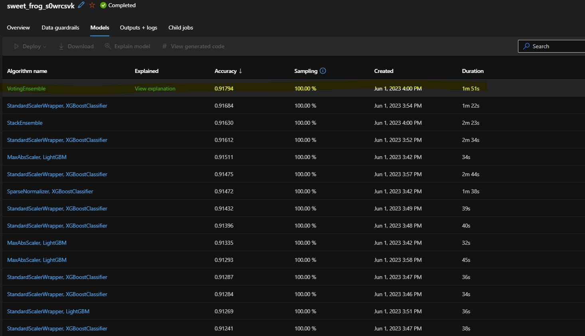

- Loading best model, using Python SDK
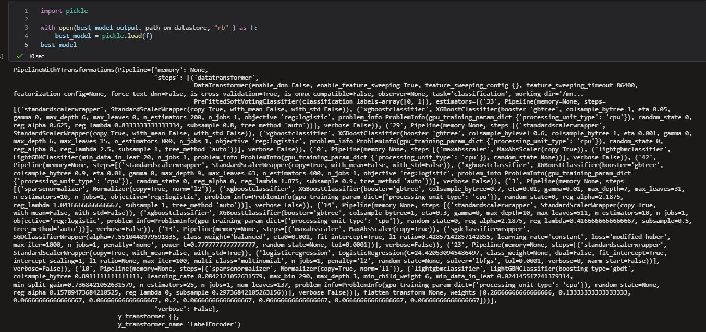

- Application Insight status:
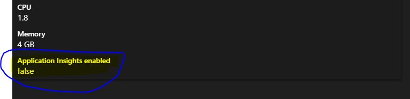

- Enabling Application Insight, using Python SDK (output is shown here)
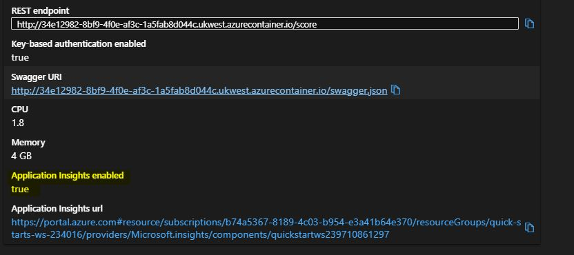

- Printing logs of deployed API, using Python SDK
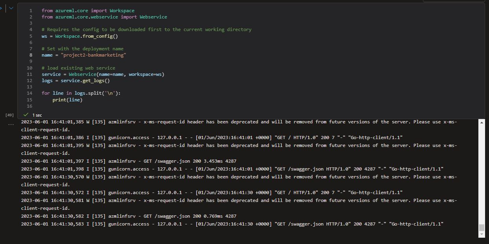

- Swagger documentation
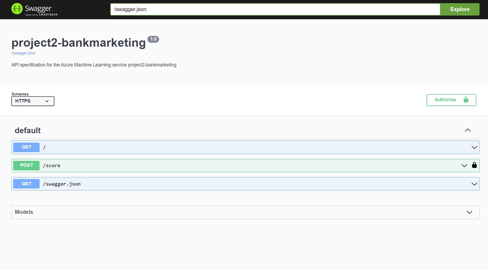

- Swagger documentation
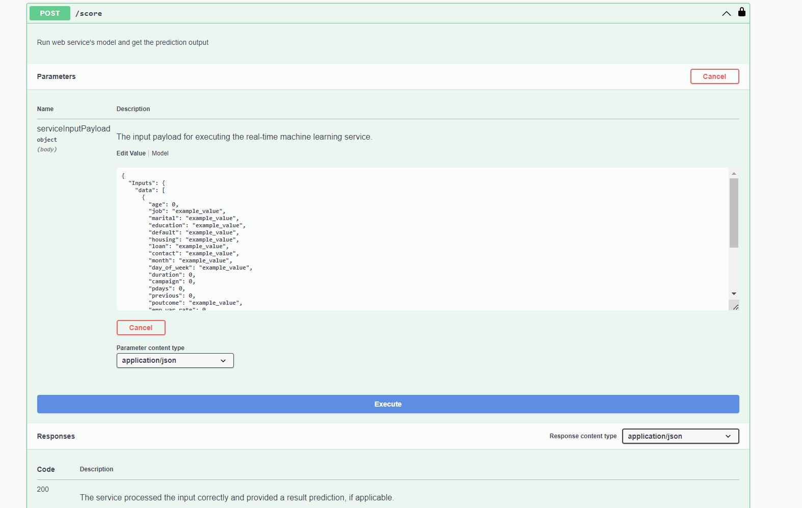

- Testing endpoints
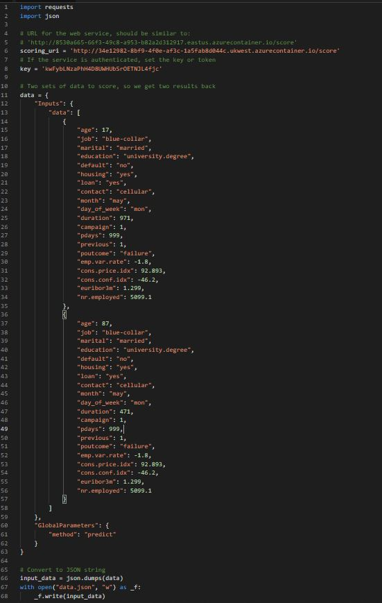

- Resposne of service endpoints
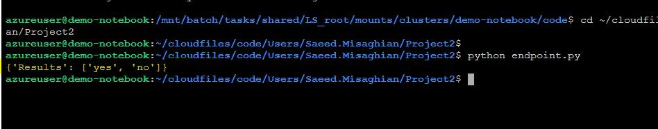

- Create Pipeline
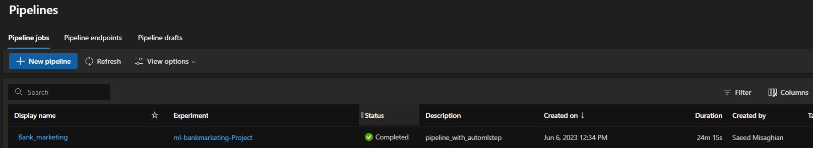

- Published Pipeline, status is active
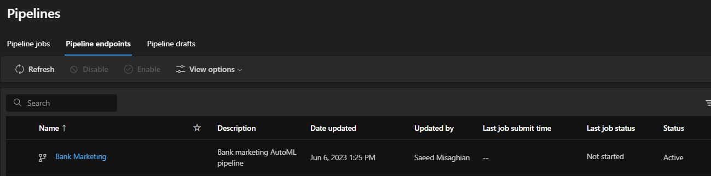

- Inside the Pipeline, showing automl and dataset
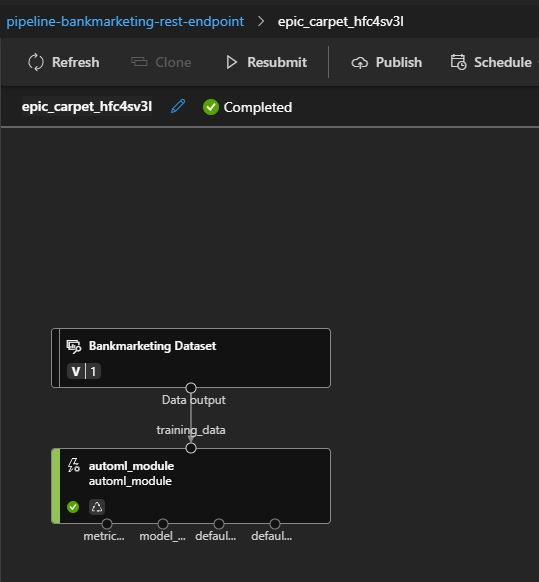

- Showing Pipeline output with widget
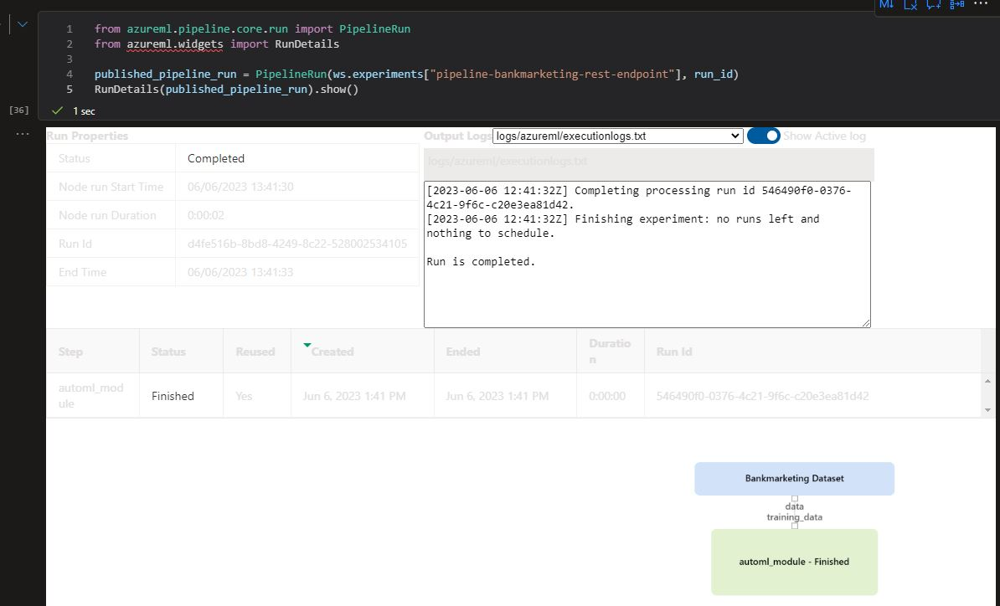

## Screen Recording
https://youtu.be/evsm82xTsEs 

